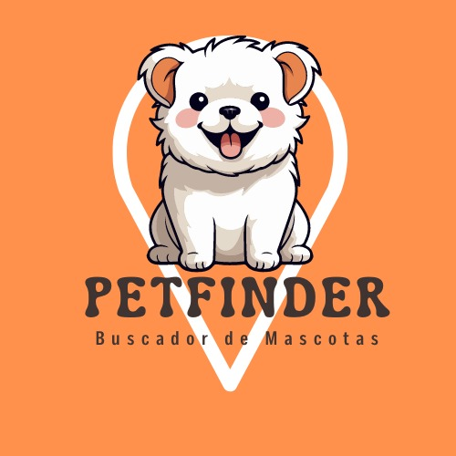

<!-- Badges -->

    
    
    

<!-- Header -->

<h1 align="center">
    
</h1>
<h4 align="center">
🐾 PetFinder 🗺️🐾: Explora el mundo de las mascotas perdidas y encontradas
</h4>

<!-- Nav -->

 <a href="#-sobre-nuestro-proyecto">Sobre</a> •
 <a href="#-funcionalidades">Funcionalidades</a> •
 <a href="#-layout">Layout</a> • 
 <a href="#-setup">Como ejecutarlo</a> • 
 <a href="#-tecnologias">Tecnologias</a> • 
 <a href="#-equipo">Equipo</a> • 
 <a href="#-capturas">Capturas</a>

<!-- Sobre nuestro proyecto -->
## 💻 Sobre nuestro proyecto
🗺️🐾 PetFinder es una plataforma diseñada para ayudar a encontrar y reunir a mascotas perdidas con sus dueños o ayudar a encontrar un nuevo hogar para mascotas encontradas. Ofrecemos una variedad de funciones que permiten a los usuarios publicar información sobre mascotas perdidas o encontradas, buscar mascotas por ubicación y características, y conectar a los usuarios para facilitar el proceso de reunión o adopción de mascotas.

## ⚙️ Funcionalidades
- [X] Registro de usuarios con información básica.
- [ ] Inicio de sesión para usuarios registrados.
- [ ] Edición y eliminación de perfiles de usuario.
- [ ] Publicación de mascotas perdidas o encontradas con información detallada.
- [ ] Búsqueda de mascotas por ubicación, etiquetas y otras características.
- [ ] Contacto entre usuarios interesados en mascotas perdidas/encontradas.
- [ ] Reporte de publicaciones inapropiadas.
- [ ] Visualización de mascotas perdidas/encontradas en un mapa interactivo.
- [ ] Notificaciones internas sobre publicaciones por área.
- [ ] Ordenamiento de notificaciones según criterios específicos.

## 🛠️ Tecnologias

## 👥 Equipo
in process...

## 🖼️ Capturas
in process...
